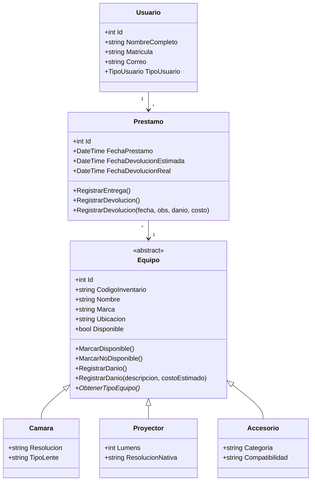

# Diseno Preliminar

## Descripcion general
El sistema representa una necesidad real: prestar y recuperar equipos audiovisuales de forma controlada. Se eligio una estructura por capas para separar responsabilidades y facilitar mantenimiento.

## Diagrama de clases

## Capas del sistema
1. **Dominio:** contiene entidades, enums y reglas del negocio.
2. **Aplicacion:** contiene servicios y casos de uso.
3. **Infraestructura:** conecta con MySQL y repositorios.
4. **Presentacion distribuida:** API REST y cliente de consola.

## Flujo basico
1. El cliente consulta equipos disponibles a traves de la API.
2. La API invoca servicios de aplicacion.
3. Los servicios validan reglas del negocio.
4. Infraestructura persiste los cambios en MySQL.
5. La API responde al cliente con los resultados.
